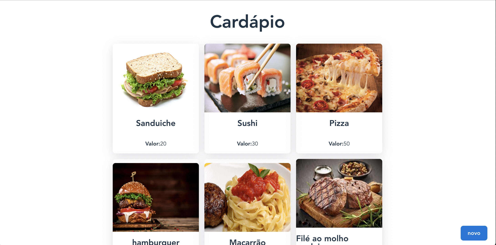
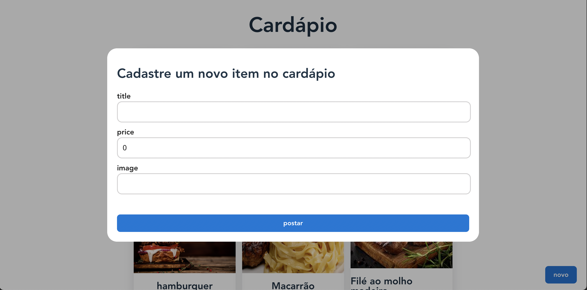

# 📱 Cardápio Digital - Frontend

Bem-vindo(a) ao **Cardápio Digital**, um projeto desenvolvido para modernizar a experiência de restaurantes e clientes. Este é um protótipo funcional de uma aplicação frontend desenvolvida com **React**, **TypeScript** e **React Query**. Ele faz parte do meu portfólio e demonstra minhas habilidades na construção de interfaces modernas e performáticas.  

<h1 align="center">
    
    
</h1>

## 🛠️ Tecnologias Utilizadas

- **React**: Biblioteca para construção de interfaces dinâmicas e interativas.  
- **TypeScript**: Superset do JavaScript, proporcionando tipagem estática e maior segurança no desenvolvimento.  
- **React Query**: Gerenciamento eficiente de dados assíncronos e cache.  

---

## 💻 Requisitos para Rodar o Projeto

Antes de começar, certifique-se de ter as seguintes ferramentas instaladas em sua máquina:  
- **Node.js**: Ambiente de execução do JavaScript no servidor.  
- **NPM** (ou **Yarn**): Gerenciador de pacotes do Node.js.  

---

## 🚀 Como Rodar a Aplicação

### 1️⃣ Clonando o Repositório  
Abra seu terminal e execute o comando:  

```bash
git clone [Ihttps://github.com/dore4n/cardapio-frontend.git]
cd frontend-cardapio
```

### 2️⃣ Instalando Dependências  
Dentro da pasta do projeto, instale as dependências com o comando:  

```bash
npm install
```

### 3️⃣ Executando o Projeto  
Para rodar o ambiente de desenvolvimento:  

```bash
npm run dev
```

O projeto estará acessível no endereço: `http://localhost:5173` (ou similar).  

---

## 🔧 Preparando para Produção  

Se você deseja compilar a aplicação para produção, utilize o comando:  

```bash
npm run build
```

Os arquivos otimizados serão gerados na pasta `dist`.  

---

## 🫂 Integração com o Backend  

Este projeto pode ser integrado a uma API desenvolvida com **Java Spring**. Confira o repositório do backend:  

👉 [Link do Repositório Backend](https://github.com/dore4n/cardapio.git)  

---

## 🌟 Funcionalidades Implementadas  

- Navegação fluida e responsiva.  
- Listagem de itens do cardápio com detalhes em modais.  
- Gerenciamento de estado assíncrono com **React Query**.  
- Estrutura de código limpa e escalável com **TypeScript**.  

---

## 🤝 Conecte-se Comigo  

Se você gostou do projeto ou tem sugestões, sinta-se à vontade para me contatar!  

- **Portfólio**: [Meu site](https://www.dore4n.github.io)  
- **LinkedIn**: [Meu Linkedin](https://www.linkedin.com/in/lucasebsantos)  
- **GitHub**: [Meu GitHub](https://www.github.com/dore4n)  

---

## 📝 Licença  

Este projeto está licenciado sob a licença MIT. Consulte o arquivo `LICENSE` para mais informações.  
```

